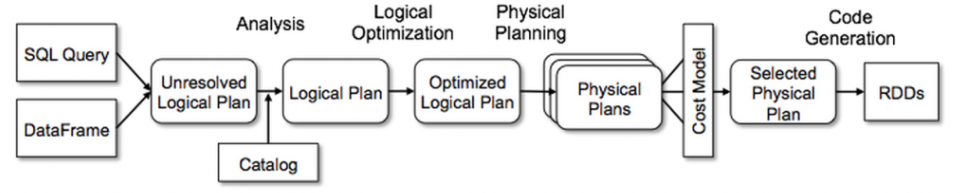

## Spark Submit
```spark-submit --master local[4] --deploy-mode client --name SparkSubmitApp "/home/nishi/PycharmProjects/pythonProject/pySpark/SparkSubmitTest.py"```
## Multi Mode Spark Engine
### Setup Master Node
```spark-class org.apache.spark.deploy.master.Master --host nishi-ubuntu```

This will open a master node and you can also open master Console ui

### Worker Node Setup

```spark-class org.apache.spark.deploy.worker.Worker spark://nishi-ubuntu:7077```

This will open a worker node, you can start multiple worker node across different session

### Catalyst Optimiser
